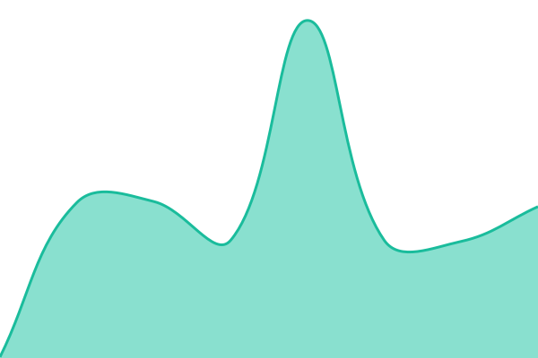

# [📈 Live Status](https://uptime.shophost.com.br): <!--live status--> **✅ Todos os serviços estão operando normalmente**

This repository contains the open-source uptime monitor and status page for [André Belli](https://arenahositing.com.br), powered by [Upptime](https://github.com/upptime/upptime).

With [Upptime](https://upptime.js.org), you can get your own unlimited and free uptime monitor and status page, powered entirely by a GitHub repository. We use [Issues](https://github.com/d-belli/shop-host-status/issues) as incident reports, [Actions](https://github.com/d-belli/shop-host-status/actions) as uptime monitors, and [Pages](https://uptime.shophost.com.br) for the status page.

<!--start: status pages-->
<!-- This summary is generated by Upptime (https://github.com/upptime/upptime) -->
<!-- Do not edit this manually, your changes will be overwritten -->
<!-- prettier-ignore -->
| URL | Status | [object Object] | Response Time | Uptime |
| --- | ------ | ------- | ------------- | ------ |
|  🌐 Site Oficial | 🟩 Up | [site-oficial.yml](https://github.com/d-belli/shop-host-status/commits/HEAD/history/site-oficial.yml) | 

 232ms
     
 | 

<a href="https://uptime.shophost.com.br/history/site-oficial">100.00%</a>
    

|  👤 Área do Cliente | 🟩 Up | [area-do-cliente.yml](https://github.com/d-belli/shop-host-status/commits/HEAD/history/area-do-cliente.yml) | 

 291ms
     
 | 

<a href="https://uptime.shophost.com.br/history/area-do-cliente">100.00%</a>
    

|  [🇧🇷 Node BR 01 - Servidor Dedicado](181.215.45.203) | 🟩 Up | [node-br-01-servidor-dedicado.yml](https://github.com/d-belli/shop-host-status/commits/HEAD/history/node-br-01-servidor-dedicado.yml) | 

 172ms
     
 | 

<a href="https://uptime.shophost.com.br/history/node-br-01-servidor-dedicado">100.00%</a>
    

<!--end: status pages-->

[**Visit our status website →**](https://uptime.shophost.com.br)

## 📄 License

- Powered by: [Upptime](https://github.com/upptime/upptime)
- Code: [MIT](./LICENSE) © [Anand Chowdhary](https://anandchowdhary.com), supported by [Pabio](https://pabio.com)
- Data in the `./history` directory: [Open Database License](https://opendatacommons.org/licenses/odbl/1-0/)
